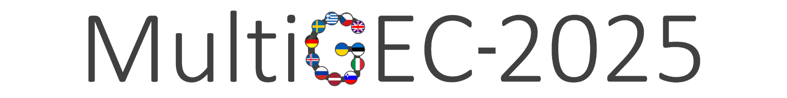

# 

###### Quick links: [call for participation](#call-for-participation) | [task description](#task-description) | [data](#data) | [evaluation](#evaluation) | [timeline](#timeline) | [publication](#publication) | [results](#results) | [organizers](#organizers) | [data providers](#data-providers) | [acknowledgements](#acknowledgements)

## Call for participation
The [Computational SLA](https://spraakbanken.gu.se/en/compsla) working group invites you to participate in the shared task on text-level Multilingual Grammatical Error Correction, **MultiGEC**, covering 12 languages: Czech, English, Estonian, German, Greek, Icelandic, Italian, Latvian, Russian, Slovene, Swedish and Ukrainian (see also the [call for participation on the ACL portal](https://www.aclweb.org/portal/content/shared-task-multilingual-grammatical-error-correction-2025)).

Automatic system evaluation will be carried out [on CodaLab](https://codalab.lisn.upsaclay.fr/competitions/20500), but the official leaderboard will be hosted on this website.

The results will be presented on March 5, 2025, at the [NLP4CALL workshop](https://spraakbanken.gu.se/en/research/themes/icall/nlp4call-workshop-series/), colocated with the [NoDaLiDa conference](https://www.nodalida-bhlt2025.eu/conference) to be held in Estonia, Tallinn, on 2--5 March 2025. 
The publication venue for system descriptions will be the proceedings of the NLP4CALL workshop, co-published in ACL anthology. 

To register for/express interest in the shared task, please fill in [this form](https://forms.gle/nTPfARVqy1XmqT4t6).   
To get important information and updates about the shared task, ask questions and hold discussions please join the [MultiGEC-2025 Google Group](https://groups.google.com/g/multigec-2025).

## Task description
In this shared task, your goal is to rewrite learner-written texts to make them grammatically correct or both grammatically correct and idiomatic, that is either adhering to the "minimal correction" principle or applying fluency edits. 

For instance, the text 

> My mother became very sad, no food. But my sister better five months later.

can be corrected minimally as 

> My mother became very sad, __and ate__ no food. But my sister __felt better__ five months later. 

or with fluency edits as

> My mother __was__ very __distressed__ __and refused to eat. Luckily__ my sister __recovered__ five months later. 

For fair evaluation of both approaches to the correction task, we will provide two evaluation metrics, one favoring minimal correction, one suited for fluency-edited output (read more under [Evaluation](#evaluation)). 

We particularly encourage development of multilingual systems that can process all (or several) languages using a single model, but this is not a mandatory requirement to participate in the task. 

## Data
We provide training, development and test data for each of the languages.

Training and validation data is available [on GitHub](https://github.com/spraakbanken/multigec-2025-participants).
To get access to this repository, you need to agree to the [Terms of Use](https://forms.gle/VLJ18WbwsxitEBYi7). 
Evaluation will be performed on a separate test set. 

A description of the data format is available [here](https://spraakbanken.github.io/multigec-2025/data_format.html).

Participants may use additional resources to build their systems __provided that the resource is publicly available for research purposes__. This includes monolingual data, artificial data, pretrained models, syntactic parsers, etc. After the shared task, we encourage participants to share any newly created resources with the community.

## Evaluation 
During the shared task, evaluation will be based on the following cross-lingually applicable __automatic metrics__:

- reference-based:
  - [GLEU score](https://github.com/cnap/gec-ranking)
  - Precision, Recall, F0.5 score
- reference-free: 
  - [Scribendi score](https://github.com/gotutiyan/scribendi_score)

After the shared task, we also plan on carrying out a __human evaluation__ experiment on a subset of the submitted results. 

## Timeline
* June 18, 2024 - first call for participation ✓
* September 20, 2024 - second call for participation ✓
* October 20, 2024 - third call for participation. Training and validation data released ✓
* October 31, 2024 - reminder. CodaLab opens for team registrations, validation phase starts ✓
* November 13, 2024 - test phase starts ✓
* November 29, 2024 - system submission deadline (system output) (__extended__); open phase starts ✓
* December 2, 2024 - results announced ✓
* January 9, 2024 - paper submission deadline with system descriptions (__extended__)
* January 20, 2025 - paper reviews sent to the authors
* February 3, 2025 - camera-ready deadline
* March 5, 2025 - presentations of the systems at the NLP4CALL workshop 

__All deadlines above are AoE__.

## Publication
We encourage you to submit a paper with your system description to the NLP4CALL workshop special track. 
We follow the same requirements for paper submissions as the NLP4CALL workshop, i.e. we use the same template and apply the same page limit. 
All papers will be reviewed by the organizing committee. 
Upon paper publication, we encourage you to share models, code, fact sheets, extra data, etc. with the community through GitHub or other repositories.

## Results
Official results for the competitive phase of the tasks, (ended on November 29, 2024) are available at the following links:

- [__minimal edits__ track](https://spraakbanken.github.io/multigec-2025/results/test_results_minimal.html)
- [__fluency edits__ track](https://spraakbanken.github.io/multigec-2025/results/test_results_fluency.html).

In addition, the latest results on the development set (last updated on January 30, 2025) are available here:

- [__minimal edits__ track](https://spraakbanken.github.io/multigec-2025/results/dev_results_jan30_minimal.md)
- [__fluency edits__ track](https://spraakbanken.github.io/multigec-2025/results/dev_results_jan30_fluency.md).

## Organizers
* [Arianna Masciolini](https://harisont.github.io/research.html), University of Gothenburg, Sweden
* [Andrew Caines](https://www.cl.cam.ac.uk/~apc38/), University of Cambridge, UK
* [Orphée De Clercq](https://research.flw.ugent.be/en/orphee.declercq), Ghent university, Belgium
* [Joni Kruijsbergen](https://www.lt3.ugent.be/people/joni-kruijsbergen/), Ghent university, Belgium
* [Murathan Kurfali](https://www.ri.se/sv/person/murathan-kurfali), RISE Research Institutes of Sweden, Sweden
* [Ricardo Muñoz Sánchez](https://rimusa.github.io/about/), University of Gothenburg, Sweden
* [Elena Volodina](https://spraakbanken.gu.se/en/about/staff/elena), University of Gothenburg, Sweden
* [Robert Östling](https://www.su.se/english/profiles/robe-1.187515), Stockholm University, Sweden

## Data providers
- Czech:
  - Alexandr Rosen, Charles University, Prague
- English:
  - Diane Nicholls, ELiT, Cambridge University Press & Assessment
  - Andrew Caines, University of Cambridge
  - Paula Buttery, University of Cambridge
- Estonian: 
  - Mark Fishel, University of Tartu, Estonia
  - Kais Allkivi, Tallinn University, Estonia
  - Kristjan Suluste, Eesti Keele Instituut, Estonia 
- German: 
  - Andrea Horbach, IPN / CAU Kiel, Germany
  - Josef Ruppenhofer, FernUniversität in Hagen, Germany
  - Katrin Wisniewski, Universität Leipzig
  - Torsten Zesch, FernUniversität in Hagen, Germany
- Greek:
  - Alexandros Tantos, Aristotle University of Thessaloniki
  - Konstantinos Tsiotskas, Aristotle University of Thessaloniki
  - Vassilis Varsamopoulos, Aristotle University of Thessaloniki
  - Pinelopi Kikilintza, Aristotle University of Thessaloniki
  - Elena Drakonaki, Aristotle University of Thessaloniki
  - Eleni Tsourilla,  Aristotle University of Thessaloniki
  - Despoina-Ourania Touriki, Aristotle University of Thessaloniki 
- Icelandic:
  - Isidora Glišić, University of Iceland
- Italian:
  - Jennifer-Carmen Frey, Eurac Research Bolzano, Italy
  - Lionel Nicolas, Eurac Research Bolzano, Italy
- Latvian: 
  - Roberts Darģis, University of Latvia
  - Ilze Auzina, University of Latvia
- Russian:
  - Alla Rozovskaya, City University of New York (CUNY), USA
- Slovene:
  - Špela Arhar Holdt, University of Ljubljana, Slovenia
  - Aleš Žagar, University of Ljubljana, Slovenia
- Swedish:
  - Arianna Masciolini, University of Gothenburg, Sweden
  - Elena Volodina, University of Gothenburg, Sweden
- Ukrainian:
  - Oleksiy Syvokon, Microsoft
  - Mariana Romanyshyn, Grammarly

## Acknowledgements
Some organizers and data providers from Sweden have been supported by Nationella språkbanken and Huminfra, both funded by the Swedish Research Council (2018-2024, contract 2017-00626; 2022-2024, contract 2021-00176) and their participating partner institutions, as well as the Swedish Research Council grant 2019-04129.

Evaluation was enabled by the National Academic Infrastructure for Supercomputing in Sweden (NAISS), partially funded by the Swedish Research Council through grant agreement no. 202206725, and by Cambridge University Press & Assessment. We thank NAISS for providing computational resources under _Projects 2024/22-21 and 2023/22-1238_. Thanks also to Christopher Bryant for discussion around the use of ERRANT cross-linguistically.

For the full subcorpus-wise acknowledgements, see [this page](https://spraakbanken.github.io/multigec-2025/contributors.html). 