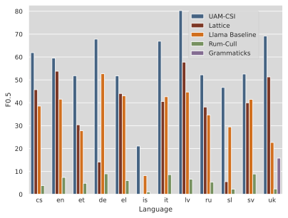

Ranking and plot based on the ERRANT-based F0.5 score.

## Czech
### NatWebInf

| Rank | Team | GLEU | Precision | Recall | __F0.5__ | Scribendi |
| ---- | ---- | ---- | --------- | ------ | ---- | --------- |
| 1 | UAM-CSI | __69.89__ | __69.81__ | __63.95__ | __68.55__ | __0.79__ |
| 2 | Lattice | 65.06 | 56.48 | 55.29 | 56.24 | 0.29 |
| 3 | baseline | 53.91 | 32.89 | 33.06 | 32.93 | 0.74 |
| 4 | Rum-Cull | 40.47 | 3.92 | 1.29 | 2.78 | 0.18 |

### Romani

| Rank | Team | GLEU | Precision | Recall | __F0.5__ | Scribendi |
| ---- | ---- | ---- | --------- | ------ | ---- | --------- |
| 1 | UAM-CSI | __60.07__ | __59.94__ | __50.13__ | __57.68__ | __0.92__ |
| 2 | Lattice | 53.7 | 48.52 | 38.06 | 45.99 | 0.84 |
| 3 | baseline | 48.35 | 38.52 | 34.52 | 37.65 | 0.82 |
| 4 | Rum-Cull | 26.49 | 6.92 | 1.34 | 3.78 | 0.24 |

### SecLearn

| Rank | Team | GLEU | Precision | Recall | __F0.5__ | Scribendi |
| ---- | ---- | ---- | --------- | ------ | ---- | --------- |
| 1 | UAM-CSI | __55.81__ | __62.58__ | __47.23__ | __58.76__ | __0.98__ |
| 2 | Lattice | 49.95 | 51.69 | 39.26 | 48.61 | 0.94 |
| 3 | baseline | 45.77 | 50.56 | 34.28 | 46.18 | 0.97 |
| 4 | Rum-Cull | 21.92 | 11.17 | 2.77 | 6.96 | 0.34 |

### NatForm

| Rank | Team | GLEU | Precision | Recall | __F0.5__ | Scribendi |
| ---- | ---- | ---- | --------- | ------ | ---- | --------- |
| 1 | UAM-CSI | __81.44__ | __68.32__ | __46.94__ | __62.62__ | __0.99__ |
| 2 | baseline | 76.08 | 40.41 | 29.0 | 37.46 | 0.92 |
| 3 | Lattice | 71.45 | 32.43 | 30.34 | 31.99 | 0.55 |
| 4 | Rum-Cull | 67.18 | 1.82 | 1.16 | 1.63 | -0.46 |

### Average

| Rank | Team | GLEU | Precision | Recall | __F0.5__ | Scribendi |
| ---- | ---- | ---- | --------- | ------ | ---- | --------- |
| 1 | UAM-CSI | __66.8__ | __65.16__ | __52.06__ | __61.9__ | __0.92__ |
| 2 | Lattice | 60.04 | 47.28 | 40.74 | 45.71 | 0.65 |
| 3 | baseline | 56.03 | 40.59 | 32.72 | 38.55 | 0.86 |
| 4 | Rum-Cull | 39.02 | 5.96 | 1.64 | 3.79 | 0.07 |

## English
### Write & Improve 2024

| Rank | Team | GLEU | Precision | Recall | __F0.5__ | Scribendi |
| ---- | ---- | ---- | --------- | ------ | ---- | --------- |
| 1 | UAM-CSI | __81.5__ | __62.24__ | __50.78__ | __59.55__ | __0.98__ |
| 2 | Lattice | 77.9 | 58.05 | 41.6 | 53.79 | 0.95 |
| 3 | baseline | 75.15 | 41.59 | 41.55 | 41.58 | __0.98__ |
| 4 | Rum-Cull | 60.2 | 9.63 | 3.8 | 7.37 | 0.34 |

## Estonian
### EIC

| Rank | Team | GLEU | Precision | Recall | __F0.5__ | Scribendi |
| ---- | ---- | ---- | --------- | ------ | ---- | --------- |
| 1 | UAM-CSI | __55.76__ | __54.39__ | __36.23__ | __49.44__ | __1.0__ |
| 2 | baseline | 36.47 | 34.02 | 11.42 | 24.38 | 0.92 |
| 3 | Lattice | 44.02 | 22.63 | 23.18 | 22.73 | 0.46 |
| 4 | Rum-Cull | 29.06 | 6.83 | 2.06 | 4.66 | -0.04 |

### EKIL2

| Rank | Team | GLEU | Precision | Recall | __F0.5__ | Scribendi |
| ---- | ---- | ---- | --------- | ------ | ---- | --------- |
| 1 | UAM-CSI | __66.85__ | __58.82__ | __41.28__ | __54.21__ | __1.0__ |
| 2 | Lattice | 56.96 | 43.54 | 25.34 | 38.07 | 0.87 |
| 3 | baseline | 51.12 | 38.73 | 17.44 | 31.13 | 0.97 |
| 4 | Rum-Cull | 42.82 | 7.47 | 2.16 | 5.0 | 0.4 |

### Average

| Rank | Team | GLEU | Precision | Recall | __F0.5__ | Scribendi |
| ---- | ---- | ---- | --------- | ------ | ---- | --------- |
| 1 | UAM-CSI | __61.3__ | __56.61__ | __38.76__ | __51.83__ | __1.0__ |
| 2 | Lattice | 50.49 | 33.09 | 24.26 | 30.4 | 0.66 |
| 3 | baseline | 43.79 | 36.38 | 14.43 | 27.76 | 0.95 |
| 4 | Rum-Cull | 35.94 | 7.15 | 2.11 | 4.83 | 0.18 |

## German
### Merlin

| Rank | Team | GLEU | Precision | Recall | __F0.5__ | Scribendi |
| ---- | ---- | ---- | --------- | ------ | ---- | --------- |
| 1 | UAM-CSI | __81.13__ | __68.17__ | __66.43__ | __67.81__ | __1.0__ |
| 2 | baseline | 69.56 | 53.01 | 51.42 | 52.68 | 0.94 |
| 3 | Lattice | 0.05 | 30.29 | 4.49 | 14.09 | -0.83 |
| 4 | Rum-Cull | 39.25 | 12.18 | 4.34 | 8.95 | 0.44 |

## Greek
### GLCII

| Rank | Team | GLEU | Precision | Recall | __F0.5__ | Scribendi |
| ---- | ---- | ---- | --------- | ------ | ---- | --------- |
| 1 | UAM-CSI | __56.84__ | __53.79__ | __45.11__ | __51.8__ | __0.88__ |
| 2 | Lattice | 51.49 | 45.78 | 38.35 | 44.07 | 0.83 |
| 3 | baseline | 45.07 | 46.95 | 32.39 | 43.07 | 0.97 |
| 4 | Rum-Cull | 24.92 | 12.53 | 1.95 | 6.0 | 0.54 |

## Icelandic
### IceEC

| Rank | Team | GLEU | Precision | Recall | __F0.5__ | Scribendi |
| ---- | ---- | ---- | --------- | ------ | ---- | --------- |
| 1 | UAM-CSI | __84.98__ | __57.28__ | __8.45__ | __26.58__ | __1.0__ |
| 2 | baseline | 80.52 | 9.6 | 5.16 | 8.19 | 0.67 |
| 3 | Rum-Cull | 81.18 | 0.85 | 0.43 | 0.71 | 0.22 |
| 4 | Lattice | 83.92 | 100.0 | 0.0 | 0.0 | 0.0 |

### IceL2EC

| Rank | Team | GLEU | Precision | Recall | __F0.5__ | Scribendi |
| ---- | ---- | ---- | --------- | ------ | ---- | --------- |
| 1 | UAM-CSI | __43.6__ | __38.68__ | __4.62__ | __15.62__ | __0.63__ |
| 2 | baseline | 39.93 | 16.88 | 2.65 | 8.14 | 0.26 |
| 3 | Rum-Cull | 39.77 | 2.77 | 0.39 | 1.25 | -0.26 |
| 4 | Lattice | 39.79 | 100.0 | 0.0 | 0.0 | 0.0 |

### Average

| Rank | Team | GLEU | Precision | Recall | __F0.5__ | Scribendi |
| ---- | ---- | ---- | --------- | ------ | ---- | --------- |
| 1 | UAM-CSI | __64.29__ | 47.98 | __6.54__ | __21.1__ | __0.82__ |
| 2 | baseline | 60.22 | 13.24 | 3.91 | 8.16 | 0.46 |
| 3 | Rum-Cull | 60.47 | 1.81 | 0.41 | 0.98 | -0.02 |
| 4 | Lattice | 61.86 | __100.0__ | 0.0 | 0.0 | 0.0 |

## Italian
### Merlin

| Rank | Team | GLEU | Precision | Recall | __F0.5__ | Scribendi |
| ---- | ---- | ---- | --------- | ------ | ---- | --------- |
| 1 | UAM-CSI | __81.89__ | __69.04__ | __59.54__ | __66.91__ | __0.98__ |
| 2 | baseline | 65.13 | 44.01 | 37.92 | 42.64 | 0.8 |
| 3 | Lattice | 69.96 | 39.9 | 43.65 | 40.59 | 0.85 |
| 4 | Rum-Cull | 50.04 | 11.13 | 4.5 | 8.6 | 0.23 |

## Latvian
### LaVA

| Rank | Team | GLEU | Precision | Recall | __F0.5__ | Scribendi |
| ---- | ---- | ---- | --------- | ------ | ---- | --------- |
| 1 | UAM-CSI | __84.5__ | __80.77__ | __78.32__ | __80.27__ | __1.0__ |
| 2 | Lattice | 67.25 | 57.8 | 57.61 | 57.77 | 0.9 |
| 3 | baseline | 48.86 | 47.43 | 36.32 | 44.69 | __1.0__ |
| 4 | Rum-Cull | 23.18 | 10.23 | 2.72 | 6.59 | 0.29 |

## Russian
### RULEC-GEC

| Rank | Team | GLEU | Precision | Recall | __F0.5__ | Scribendi |
| ---- | ---- | ---- | --------- | ------ | ---- | --------- |
| 1 | UAM-CSI | __83.11__ | __61.09__ | 33.01 | __52.21__ | __0.46__ |
| 2 | Lattice | 77.77 | 42.33 | 27.38 | 38.16 | 0.33 |
| 3 | baseline | 79.02 | 34.53 | __35.46__ | 34.71 | 0.42 |
| 4 | Rum-Cull | 73.23 | 6.34 | 3.22 | 5.31 | 0.41 |

## Slovene
### Solar-Eval

| Rank | Team | GLEU | Precision | Recall | __F0.5__ | Scribendi |
| ---- | ---- | ---- | --------- | ------ | ---- | --------- |
| 1 | UAM-CSI | __66.46__ | __53.89__ | __30.4__ | __46.68__ | __1.0__ |
| 2 | baseline | 58.96 | 35.97 | 17.06 | 29.45 | 0.71 |
| 3 | Lattice | 54.34 | 8.67 | 2.25 | 5.52 | -0.06 |
| 4 | Rum-Cull | 49.52 | 3.64 | 0.93 | 2.3 | 0.59 |

## Swedish
### SweLL_gold

| Rank | Team | GLEU | Precision | Recall | __F0.5__ | Scribendi |
| ---- | ---- | ---- | --------- | ------ | ---- | --------- |
| 1 | UAM-CSI | __69.29__ | __54.54__ | __45.88__ | __52.56__ | __1.0__ |
| 2 | baseline | 58.4 | 44.9 | 31.74 | 41.46 | __1.0__ |
| 3 | Lattice | 59.88 | 41.49 | 35.02 | 40.01 | __1.0__ |
| 4 | Rum-Cull | 38.28 | 14.02 | 3.6 | 8.88 | 0.56 |

## Ukrainian
### UA-GEC

| Rank | Team | GLEU | Precision | Recall | __F0.5__ | Scribendi |
| ---- | ---- | ---- | --------- | ------ | ---- | --------- |
| 1 | UAM-CSI | __79.55__ | __74.31__ | __54.11__ | __69.15__ | __0.89__ |
| 2 | Lattice | 74.0 | 58.55 | 34.28 | 51.29 | 0.1 |
| 3 | baseline | 68.03 | 26.1 | 14.82 | 22.66 | 0.41 |
| 4 | Grammaticks | 62.93 | 16.53 | 13.48 | 15.81 | -0.1 |
| 5 | Rum-Cull | 65.38 | 3.15 | 1.18 | 2.36 | 0.62 |

